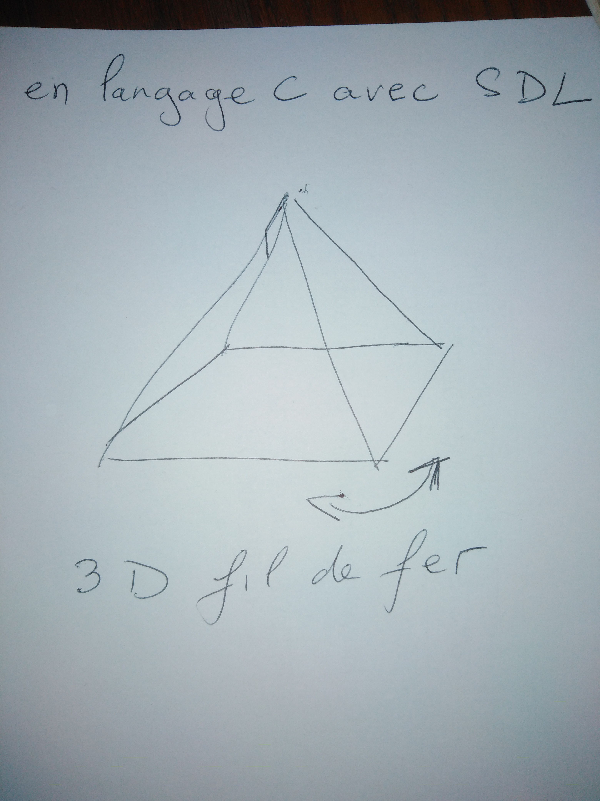

---

On dirait que tu veux faire un rendu **3D fil de fer (wireframe)** en C avec SDL, avec une forme type pyramide qui tourne 👍

Je te donne une base simple pour démarrer.

---

### 🧠 Principe
1. Définir des points 3D
2. Appliquer une rotation
3. Projeter en 2D
4. Dessiner les arêtes avec SDL

---

### 📦 Exemple minimal (SDL2 + C)

```c
#include <SDL2/SDL.h>
#include <math.h>

#define WIDTH 800
#define HEIGHT 600

typedef struct {
    float x, y, z;
} Vec3;

typedef struct {
    int a, b;
} Edge;

// projection simple
void project(Vec3 p, int *x, int *y) {
    float distance = 3.0;
    float factor = distance / (distance + p.z);

    *x = (int)(p.x * factor * 200 + WIDTH / 2);
    *y = (int)(-p.y * factor * 200 + HEIGHT / 2);
}

// rotation autour de Y
Vec3 rotateY(Vec3 p, float angle) {
    Vec3 r;
    r.x = p.x * cos(angle) - p.z * sin(angle);
    r.z = p.x * sin(angle) + p.z * cos(angle);
    r.y = p.y;
    return r;
}

int main() {
    SDL_Init(SDL_INIT_VIDEO);

    SDL_Window *win = SDL_CreateWindow("3D fil de fer",
        SDL_WINDOWPOS_CENTERED, SDL_WINDOWPOS_CENTERED,
        WIDTH, HEIGHT, 0);

    SDL_Renderer *ren = SDL_CreateRenderer(win, -1, SDL_RENDERER_ACCELERATED);

    // pyramide
    Vec3 points[] = {
        {0, 1, 0},    // sommet
        {-1, -1, -1},
        {1, -1, -1},
        {1, -1, 1},
        {-1, -1, 1}
    };

    Edge edges[] = {
        {0,1},{0,2},{0,3},{0,4},
        {1,2},{2,3},{3,4},{4,1}
    };

    float angle = 0;
    int running = 1;
    SDL_Event e;

    while (running) {
        while (SDL_PollEvent(&e)) {
            if (e.type == SDL_QUIT) running = 0;
        }

        SDL_SetRenderDrawColor(ren, 0, 0, 0, 255);
        SDL_RenderClear(ren);

        SDL_SetRenderDrawColor(ren, 255, 255, 255, 255);

        Vec3 rotated[5];

        for (int i = 0; i < 5; i++) {
            rotated[i] = rotateY(points[i], angle);
        }

        for (int i = 0; i < 8; i++) {
            int x1, y1, x2, y2;

            project(rotated[edges[i].a], &x1, &y1);
            project(rotated[edges[i].b], &x2, &y2);

            SDL_RenderDrawLine(ren, x1, y1, x2, y2);
        }

        SDL_RenderPresent(ren);

        angle += 0.01f;
        SDL_Delay(16);
    }

    SDL_DestroyRenderer(ren);
    SDL_DestroyWindow(win);
    SDL_Quit();

    return 0;
}
```

---

### ✅ Résultat
- Une pyramide en **fil de fer**
- Rotation automatique (comme ton dessin avec la flèche 🔄)

---

### 💡 Pour aller plus loin
- Ajouter rotation X + Z
- Ajouter contrôle clavier
- Faire un cube ou une forme custom
- Ajouter perspective plus réaliste

---

Si tu veux, je peux te faire **exactement la forme de ton dessin (avec les diagonales internes)** 👍