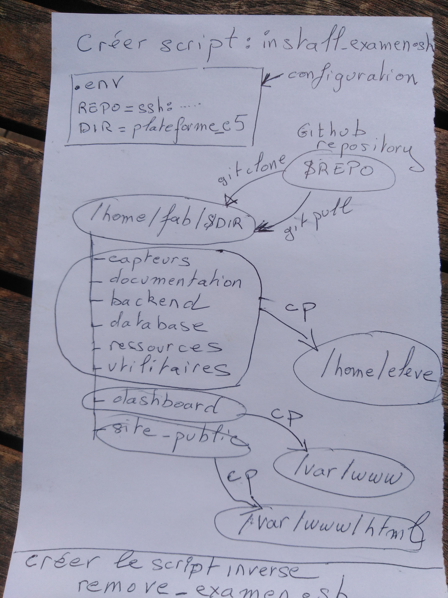

---

Got it — your sketch describes a deployment script (`install-examen.sh`) that:

- reads config (`REPO`, `DIR`)
- clones/pulls a repo into `/home/fab/$DIR`
- copies different parts to:
  - `/home/eleve`
  - `/var/www`
  - `/var/www/html`

and you also want the reverse script.

Here’s a clean version of both scripts 👇

---

# ✅ `install-examen.sh`

```bash
#!/bin/bash

set -e

### CONFIG ###
REPO="git@github.com:your/repo.git"
DIR="plateforme_c5"

BASE_DIR="/home/fab/$DIR"
ELEVE_DIR="/home/eleve"
WWW_DIR="/var/www"
HTML_DIR="/var/www/html"

echo "== Installation en cours =="

# Clone ou update repo
if [ -d "$BASE_DIR/.git" ]; then
    echo "Repo déjà présent → git pull"
    cd "$BASE_DIR"
    git pull
else
    echo "Clonage du repo"
    git clone "$REPO" "$BASE_DIR"
fi

# Copie vers /home/eleve
echo "Copie vers $ELEVE_DIR"
cp -r "$BASE_DIR/capteurs" "$ELEVE_DIR/" 2>/dev/null || true
cp -r "$BASE_DIR/documentation" "$ELEVE_DIR/" 2>/dev/null || true
cp -r "$BASE_DIR/backend" "$ELEVE_DIR/" 2>/dev/null || true
cp -r "$BASE_DIR/database" "$ELEVE_DIR/" 2>/dev/null || true
cp -r "$BASE_DIR/ressources" "$ELEVE_DIR/" 2>/dev/null || true
cp -r "$BASE_DIR/utilitaires" "$ELEVE_DIR/" 2>/dev/null || true

# Dashboard → /var/www
echo "Copie dashboard → $WWW_DIR"
cp -r "$BASE_DIR/dashboard" "$WWW_DIR/" 2>/dev/null || true

# Site public → /var/www/html
echo "Copie site-public → $HTML_DIR"
cp -r "$BASE_DIR/site-public" "$HTML_DIR/" 2>/dev/null || true

echo "✅ Installation terminée"
```

---

# 🔁 `remove-examen.sh` (script inverse)

```bash
#!/bin/bash

set -e

DIR="plateforme_c5"

BASE_DIR="/home/fab/$DIR"
ELEVE_DIR="/home/eleve"
WWW_DIR="/var/www"
HTML_DIR="/var/www/html"

echo "== Suppression en cours =="

# Supprimer dossier cloné
echo "Suppression $BASE_DIR"
rm -rf "$BASE_DIR"

# Supprimer fichiers copiés
echo "Nettoyage $ELEVE_DIR"
rm -rf "$ELEVE_DIR/capteurs"
rm -rf "$ELEVE_DIR/documentation"
rm -rf "$ELEVE_DIR/backend"
rm -rf "$ELEVE_DIR/database"
rm -rf "$ELEVE_DIR/ressources"
rm -rf "$ELEVE_DIR/utilitaires"

echo "Nettoyage $WWW_DIR"
rm -rf "$WWW_DIR/dashboard"

echo "Nettoyage $HTML_DIR"
rm -rf "$HTML_DIR/site-public"

echo "✅ Suppression terminée"
```

---

# ⚠️ Conseils importants

- Lance avec sudo si nécessaire:
  ```bash
  sudo ./install-examen.sh
  ```

- Rends les scripts exécutables:
  ```bash
  chmod +x install-examen.sh remove-examen.sh
  ```

- Si `/var/www` est protégé → permissions à vérifier

---

# 💡 Amélioration possible

Tu peux ajouter un fichier `.env` :

```bash
REPO=git@github.com:your/repo.git
DIR=plateforme_c5
```

et le charger avec :

```bash
source .env
```

---

Si tu veux, je peux te faire une version **plus robuste (logs + vérifications + rollback)** ou une version adaptée pour examen automatique 👍
